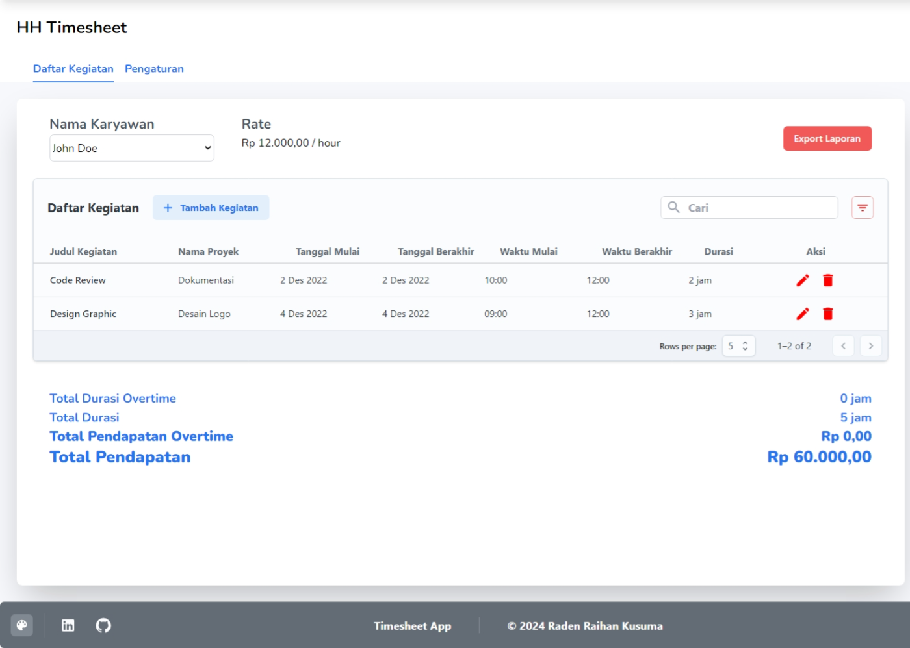
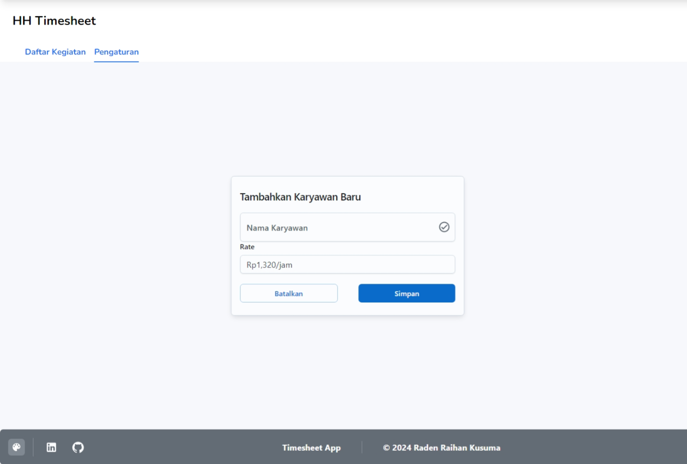
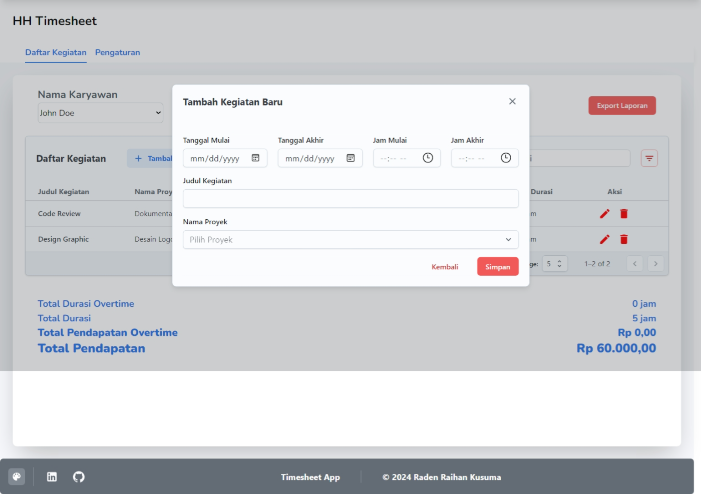
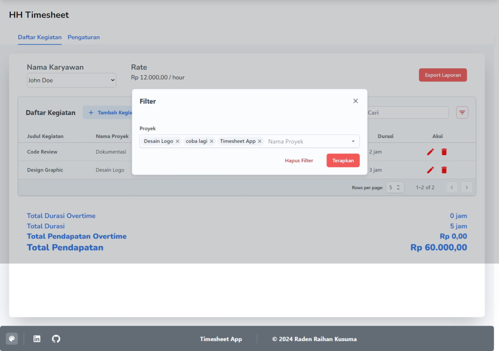

# Timesheet Management App

The Timesheet Management App is a tool designed to track the activities of freelancers. It allows you to add employees, set their hourly rates in Indonesian Rupiah, and record their activities with details such as activity title, project name, start date, end date, start time, end time, duration, and total hours. Additional features of the app include calculating total income, overtime duration, and overtime income for each employee. It also provides filtering, sorting, pagination, searching, updating, and deleting functionalities for recorded activities. One of the key features of the Timesheet Management App is the ability to export the recorded activities data to Excel. This allows you to easily analyze and share the data with others. The exported Excel file includes all the relevant information about the activities, such as employee details, project name, duration, and total hours. 

## Tech Stack

The Timesheet App is built using the following technologies:

- **Supabase(PostgreSQL)**: A powerful open-source alternative to Firebase for backend services and database management.
- **Express.js**: A fast and minimalist web application framework for Node.js.
- **Next.js**: A React framework for building server-side rendered and static websites.
- **Sequelize**: A promise-based Node.js ORM for PostgreSQL, MySQL, MariaDB, SQLite, and Microsoft SQL Server.
- **Vercel**: A cloud platform for static sites and serverless functions, used for deployment.
- **Tailwind CSS**: A utility-first CSS framework for rapidly building custom user interfaces.

These technologies work together to provide a robust and efficient solution for tracking freelancer activities in the Timesheet App.

## Usage

You can try the app on my deployment website here: https://timesheet-hh.vercel.app/, 
Or if you want to use the Timesheet Management App locally, follow these steps:

1. Clone the repository:
     ```
     git clone https://github.com/your-username/timesheet-app.git
     ```

2. Navigate to the backend directory:
     ```
     cd timesheet-app/backend
     ```

3. Install the dependencies:
     ```
     npm install
     ```

4. Set up the database:
     - If you are using Supabase:
       - Create a Supabase project and obtain the connection URL and API key.
       - Set up the database by running the following commands:
           ```
           npx sequelize-cli db:create
           npx sequelize-cli db:migrate
           npx sequelize-cli db:seed:all  # Optional: Seed the database with sample data
           ```

     - If you are using local PostgreSQL:
       - Set up a local PostgreSQL database and update the database configuration in `config/config.json`.
       - Run the following commands to set up the database:
           ```
           npx sequelize-cli db:create
           npx sequelize-cli db:migrate
           npx sequelize-cli db:seed:all  # Optional: Seed the database with sample data
           ```

5. Start the backend server:
     ```
     npm run dev
     ```

6. Navigate to the frontend directory:
     ```
     cd ../frontend
     ```

7. Install the dependencies:
     ```
     npm install
     ```

8. Set the environment variables:
     - If you are running the backend locally, create a file named `.env.local` in the frontend directory and set the following variable:
       ```
       NEXT_PUBLIC_API_URL=http://localhost:3000/api
       ```

     - If you are using the deployment server `timesheet.raihankusuma.tech`, no additional configuration is required.

9. Start the frontend development server:
     ```
     npm run dev
     ```

10. Access the Timesheet Management App:
      - If you are running the backend locally, open your browser and go to `http://localhost:3000`.
      - If you are using the deployment server, open your browser and go to `https://timesheet.raihankusuma.tech`.

You are now ready to use the Timesheet Management App. Follow the instructions provided in the app to add employees and record activities.

## Features

The Timesheet Management App offers the following features:

- **Add Employees**: You can add employees to the app by providing their details such as name, position, and hourly rate in Indonesian Rupiah.

- **Record Activities**: The app allows you to record activities for each employee. Each activity should include the following information:
     - Activity Title: A brief description of the activity.
     - Project Name: The name of the project the activity is associated with.
     - Start Date: The date when the activity started.
     - End Date: The date when the activity ended.
     - Start Time: The time when the activity started each day.
     - End Time: The time when the activity ended each day.
     - Duration: The duration of the activity for each day.
     - Total Hours: The total hours worked on the activity.

- **Calculate Total Income**: The app calculates the total income for each employee based on their hourly rate and the total hours worked on recorded activities.

- **Calculate Overtime Duration**: The app calculates the overtime duration for each employee based on the total hours worked on recorded activities and predefined working hours.

- **Calculate Overtime Income**: The app calculates the overtime income for each employee based on the overtime duration and overtime rate.

- **Filtering**: You can filter the recorded activities based on project name.

- **Sorting**: You can sort the recorded activities based on different attributes such as date, duration, and project name.

- **Pagination**: The app supports pagination to display a limited number of activities per page, improving performance and user experience.

- **Searching**: You can search for specific activities or employees using keywords.

- **Updating**: You can update the details of recorded activities or employee information.

- **Deleting**: You can delete recorded activities or employee information.

- **Export to Excel**: You can export the recorded activities data to an Excel file for further analysis and sharing. The exported Excel file will include all the relevant information about the activities, such as employee details, project name, duration, and total hours.

## Screenshots

Here are some screenshots of the Timesheet Management App:

### Home

### Settings/Add Employee

### Add Activity

### Filtering


## API Documentation

The Timesheet Management App provides the following API routes:

### Employee Routes

#### Get All Employees

- **URL**: `/api/employees`
- **Method**: `GET`
- **Description**: Retrieves all employees.
- **Response**: Returns an array of employee objects.

#### Get Employee by ID

- **URL**: `/api/employees/:id`
- **Method**: `GET`
- **Description**: Retrieves an employee by ID.
- **Parameters**:
     - `id` (required): The ID of the employee.
- **Response**: Returns the employee object.

#### Create Employee

- **URL**: `/api/employees`
- **Method**: `POST`
- **Description**: Creates a new employee.
- **Request Body**: Requires a JSON object with the following properties:
     - `name` (required): The name of the employee.
     - `position` (required): The position of the employee.
     - `hourlyRate` (required): The hourly rate of the employee in Indonesian Rupiah.
- **Response**: Returns the created employee object.

#### Update Employee

- **URL**: `/api/employees/:id`
- **Method**: `PUT`
- **Description**: Updates an existing employee.
- **Parameters**:
     - `id` (required): The ID of the employee.
- **Request Body**: Requires a JSON object with the following properties (at least one property is required):
     - `name`: The updated name of the employee.
     - `position`: The updated position of the employee.
     - `hourlyRate`: The updated hourly rate of the employee in Indonesian Rupiah.
- **Response**: Returns the updated employee object.

#### Delete Employee

- **URL**: `/api/employees/:id`
- **Method**: `DELETE`
- **Description**: Deletes an employee.
- **Parameters**:
     - `id` (required): The ID of the employee.
- **Response**: Returns a success message.

### Activity Routes

#### Get All Activities

- **URL**: `/api/activities`
- **Method**: `GET`
- **Description**: Retrieves all activities.
- **Response**: Returns an array of activity objects.

#### Get Activity by ID

- **URL**: `/api/activities/:id`
- **Method**: `GET`
- **Description**: Retrieves an activity by ID.
- **Parameters**:
     - `id` (required): The ID of the activity.
- **Response**: Returns the activity object.

#### Create Activity

- **URL**: `/api/activities`
- **Method**: `POST`
- **Description**: Creates a new activity.
- **Request Body**: Requires a JSON object with the following properties:
     - `employeeId` (required): The ID of the employee associated with the activity.
     - `title` (required): The title of the activity.
     - `projectName` (required): The name of the project associated with the activity.
     - `startDate` (required): The start date of the activity.
     - `endDate` (required): The end date of the activity.
     - `startTime` (required): The start time of the activity each day.
     - `endTime` (required): The end time of the activity each day.
     - `duration` (required): The duration of the activity for each day.
     - `totalHours` (required): The total hours worked on the activity.
- **Response**: Returns the created activity object.

#### Update Activity

- **URL**: `/api/activities/:id`
- **Method**: `PUT`
- **Description**: Updates an existing activity.
- **Parameters**:
     - `id` (required): The ID of the activity.
- **Request Body**: Requires a JSON object with the following properties (at least one property is required):
     - `employeeId`: The updated ID of the employee associated with the activity.
     - `title`: The updated title of the activity.
     - `projectName`: The updated name of the project associated with the activity.
     - `startDate`: The updated start date of the activity.
     - `endDate`: The updated end date of the activity.
     - `startTime`: The updated start time of the activity each day.
     - `endTime`: The updated end time of the activity each day.
     - `duration`: The updated duration of the activity for each day.
     - `totalHours`: The updated total hours worked on the activity.
- **Response**: Returns the updated activity object.

#### Delete Activity

- **URL**: `/api/activities/:id`
- **Method**: `DELETE`
- **Description**: Deletes an activity.
- **Parameters**:
     - `id` (required): The ID of the activity.
- **Response**: Returns a success message.

